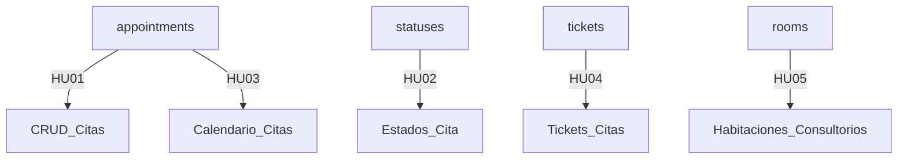

# Módulo 05 - Gestión de Citas y Agenda Médica 🗓️

## Índice
1. [Introducción](#introducción)
2. [Estructura del Módulo](#estructura-del-módulo)
3. [Submódulos y sus Historias de Usuario](#submódulos-y-sus-historias-de-usuario)
    - [appointments/ (HU01, HU03)](#appointments)
    - [statuses/ (HU02)](#statuses)
    - [tickets/ (HU04)](#tickets)
    - [rooms/ (HU05)](#rooms)
4. [Diagrama de la Estructura](#diagrama-de-la-estructura)
5. [Notas y Recomendaciones](#notas-y-recomendaciones)

---

## Introducción
Este módulo es responsable de la gestión integral de las citas médicas y la agenda de un centro de salud. Permite administrar el ciclo completo de una cita: desde su creación, visualización y actualización, hasta la gestión de estados, generación de tickets y asignación de habitaciones o consultorios. La organización en submódulos facilita el trabajo colaborativo, la escalabilidad y el mantenimiento del sistema.

---

## Estructura del Módulo
La carpeta `05_appointments_status` está organizada en los siguientes submódulos:

```
05_appointments_status/
│
├── appointments/   # Gestión y visualización de citas (HU01, HU03)
├── statuses/       # Gestión de estados de cita (HU02)
├── tickets/        # Gestión de tickets para citas (HU04)
├── rooms/          # Gestión de habitaciones/consultorios (HU05)
└── README.md       # Documentación general del módulo
```

Cada submódulo agrupa los archivos y la lógica relacionada con una funcionalidad específica, alineada con una historia de usuario principal.

---

## Submódulos y sus Historias de Usuario

### <a name="appointments"></a>appointments/ — HU01 y HU03

#### HU01 - Gestión de Citas: CRUD Completo
Permite crear, listar, actualizar y eliminar citas médicas, con validaciones, filtros y paginación. Es el núcleo de la agenda, asegurando que cada cita tenga paciente, terapeuta, fecha, hora, estado y motivo, y evitando solapamientos.

#### HU03 - Visualización de Calendario de Citas
Proporciona la lógica y los endpoints para mostrar un calendario visual de citas, con filtros por terapeuta, paciente, estado y fechas, y actualización en tiempo real. Facilita la gestión visual de la carga de trabajo y la disponibilidad.

**Archivos típicos:**
- Appointment.php, AppointmentController.php, AppointmentService.php
- AppointmentsPaginatedByDateRequest.php, CompletedAppointmentsCalendarByDateRequest.php, etc.

---

### <a name="statuses"></a>statuses/ — HU02

#### HU02 - Gestión de Estados de Cita
Permite definir, actualizar y validar los estados de una cita (pendiente, confirmada, completada, cancelada, etc.), así como controlar las transiciones válidas y registrar auditoría de cambios. Es clave para reflejar el flujo real de atención.

**Archivos típicos:**
- AppointmentStatus.php, AppointmentStatusController.php, AppointmentStatusService.php
- StoreAppointmentStatusRequest.php, UpdateAppointmentStatusRequest.php

---

### <a name="tickets"></a>tickets/ — HU04

#### HU04 - Gestión de Tickets para Citas
Permite generar y gestionar tickets únicos asociados a cada cita, incluyendo información relevante (paciente, terapeuta, fecha, estado, monto, etc.), control de pagos y seguimiento. Facilita la trazabilidad y la gestión administrativa.

**Archivos típicos:**
- TicketController.php, TicketRequest.php, TicketService.php

---

### <a name="rooms"></a>rooms/ — HU05

#### HU05 - Gestión de Habitaciones/Consultorios
Permite crear, editar y eliminar habitaciones o consultorios, asignarlos a citas y validar la disponibilidad para evitar solapamientos. Optimiza el uso de los espacios físicos y previene conflictos de agenda.

**Archivos típicos:**
- (Por implementar: Room.php, RoomController.php, RoomService.php, etc.)

---

## Diagrama de la Estructura



---

## Notas y Recomendaciones
- Cada submódulo puede tener su propio README.md para detallar aspectos técnicos, endpoints y flujos específicos.
- Esta estructura permite que equipos diferentes trabajen en paralelo y facilita la escalabilidad del sistema.
- Las historias de usuario y checklists (ver más arriba en este archivo) sirven como guía para el desarrollo, pruebas y validación de funcionalidades.
- Si se agregan nuevas funcionalidades, simplemente se crea un nuevo submódulo o se amplía el existente.

---

**¡Esta organización está pensada para que el desarrollo sea claro, ordenado y colaborativo!** 